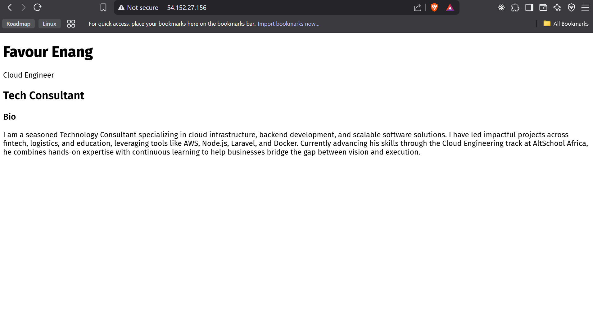

## Second Semester

### 🌐 Live Site

http://54.152.27.156

### 🧠 Concept

I see myself as a consultant collaborating with diverse enterprises to solve complex problems and develop impactful products. That's the idea behind me learning

### 🛠️ Tech Stack

- Ubuntu 22.04 on AWS EC2
- Nginx (reverse proxy)
- Node.js
- TailwindCSS

### 📸 Screenshot



### 🔐 Networking

- Ports: 22 (SSH), 80 (HTTP)
- 443 (HTTPS) was not impelemented because I don't have domain
- Firewall rules configured in AWS

### 📁 Deployment Steps

1. Provision EC2

   Create an AWS EC2 Instance
   Go to the AWS EC2 Dashboard.

   Click “Launch Instance.”

   Choose an Amazon Machine Image (AMI):
   ✅ Recommended: Ubuntu Server 22.04 LTS

   Choose an Instance Type:
   ✅ e.g., t2.micro (eligible for free tier)

   Configure the instance:

   Set key pair: Create new or use existing .pem key

   Allow ports: HTTP (80), HTTPS (443), and SSH (22)

   Launch the instance and wait for it to initialize.

2. Install Node, Nginx

   1. ssh into the create ec2

   ```bash
     chmod 400 your-key.pem #your pem key from aws
     ssh -i "your-key.pem" ubuntu@<your-ec2-public-ip>

   ```

   2. Set up required packages and nodejs on the instance

   ```bash
      #set up nginx
     sudo apt update && sudo apt upgrade -y
     sudo apt install nginx git curl -y

     #set up nodejs
     curl -fsSL https://deb.nodesource.com/setup_18.x | sudo -E bash -
      sudo apt install -y nodejs
      node -v
      npm -v

      #set up pm2 to manage process
      sudo npm install -g pm2

   ```

3. Clone this repo and run app

   ```bash
    https://github.com/owujib/altschool-semester-2.git

    cd altschool-semester-2

    npm install

    pm2 start server.js --name exam-2
    pm2 save
   ```

4. Configure Nginx reverse proxy

   ```bash
      sudo nano /etc/nginx/sites-available/altschool

     sudo ln -s /etc/nginx/sites-available/altschool /etc/nginx/sites-enabled


     server {
         listen 80;
         server_name your-ec2-public-ip;

         location / {
             proxy_pass http://localhost:3000;
             proxy_http_version 1.1;
             proxy_set_header Upgrade $http_upgrade;
             proxy_set_header Connection 'upgrade';
             proxy_set_header Host $host;
             proxy_cache_bypass $http_upgrade;
         }
     }

   sudo systemctl restart nginx
   ```
